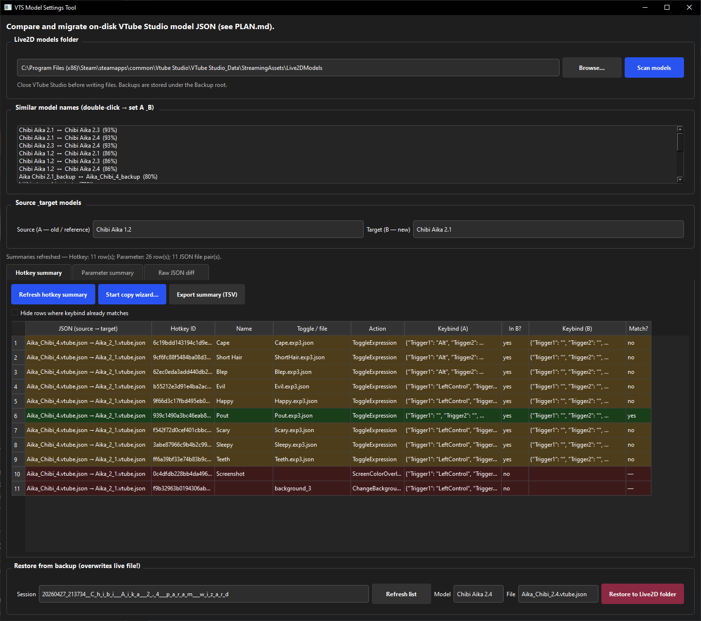
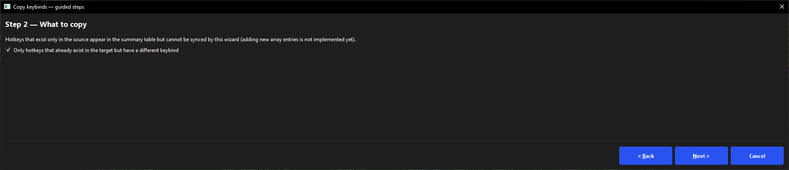
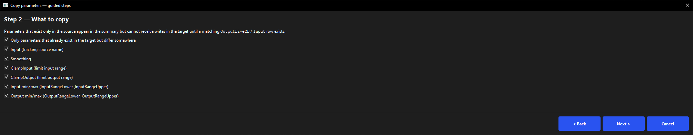

# VTS Model Settings Tool

Desktop utility for **[VTube Studio](https://denchisoft.com/)** users who want to **compare, summarize, and copy** model settings stored in on-disk **JSON** (especially `*.vtube.json`) between two Live2D model folders — for example after a model update when filenames changed but you want the same hotkeys and parameter mappings.

**This project is not affiliated with DenchiSoft.** It only reads/writes the same public file format VTS generates next to your models.


 *(primary; PyQt6 may work elsewhere)*

---

## Screenshots

**Main window**



**Hotkey copy wizard**



**Parameter / settings copy wizard**



---

## Features

| Area | What you get |
|------|----------------|
| **Hotkey summary** | All paired JSON files between **source** and **target** models: hotkey ID, toggle file, `Triggers` / `keyCombination`, whether the hotkey exists in the target, and if keybinds match. Pairs **`*.vtube.json` even when filenames differ** between folders. |
| **Hotkey wizard** | Multi-step: scope → preview → backup → write. Copies keybind data **only** into hotkeys that **already exist** in the target (matched by ID or name + toggle file). |
| **Parameter summary** | `ParameterSettings` rows matched by **`OutputLive2D`** (fallback: **`Input`**). Compare **Input**, **ClampInput** / **ClampOutput**, **Smoothing**, input/output range min/max. |
| **Parameter wizard** | Select which fields to copy; preview leaf writes; backup; apply. Same “existing row only” rule as hotkeys. |
| **Raw JSON diff** | Pick a file that exists in both folders (same basename); deep diff with optional list alignment by ID keys. Direct copy of selected rows (power users). |
| **Backups** | Timestamped backup folders before writes; restore single files from the UI. |

---

## Requirements

- **Python 3.11+** (for source runs)
- **Windows** tested (Steam VTube Studio paths). Other OS: try PyQt6 if you build from source.

---

## Quick start (from source)

```bash
git clone <your-fork-or-repo-url> vts-model-settings-tool
cd vts-model-settings-tool

python -3.11 -m venv venv
# Windows:
venv\Scripts\activate
# Linux/macOS:
# source venv/bin/activate

pip install -r requirements.txt
python main.py
```

On first launch, set **Live2D models folder** to your VTS `Live2DModels` directory, e.g.:

`…\VTube Studio_Data\StreamingAssets\Live2DModels`

(Optional) Copy `config.ini.example` to `config.ini` next to `main.py` and edit before first run.

---

## Build a standalone `.exe` (Windows)

```bat
build_exe.bat
```

Output: `dist\VTSModelSettingsTool.exe`  

The batch file creates a `venv\`, installs `requirements.txt` + `requirements-build.txt`, and runs **PyInstaller** (`--onefile --windowed`).  

Copy **`config.ini.example`** → **`config.ini`** next to the EXE if you want to pre-fill paths; otherwise the app creates defaults when you save settings.

---

## Usage tips

1. **Close VTube Studio** before writing JSON on disk so VTS does not overwrite your changes.
2. Choose **source (A)** = older/reference model folder, **target (B)** = new folder.
3. Use **Scan models**, then **Hotkey summary** / **Parameter summary** → **Refresh**.
4. Prefer **Start copy wizard…** over raw diff for guided backups and previews.
5. **Exports**: TSV export on each summary tab for spreadsheets or changelog archives.

### Matching & limits

- **Hotkeys / parameters** are **not** auto-created in the target if that array entry does not exist. The summary still lists source-only rows so you know what’s missing.
- On-disk hotkeys use PascalCase (`HotkeyID`, `Triggers`, …); the tool handles that and API-style `keyCombination` when present.
- If a model folder has **multiple** `*.vtube.json` files, the tool picks the first by sorted name for cross-folder pairing (`vtube_file()`). Prefer one primary file per folder.

---

## Configuration

Settings live in **`config.ini`** next to `main.py` or the frozen `.exe`:

| Section | Role |
|---------|------|
| `[Paths]` | `live2d_models_path` |
| `[Backup]` | `root` (backup directory) |
| `[UI]` | Window size, last models, diff options |
| `[Diff]` | Alignment keys, similarity hints |

Changes in the UI are saved to this file when you modify them.

---

## Repository layout

```
main.py                 # Entry point
vts_mst/                # Application package (UI, diff, hotkeys, parameters, …)
screenshots/            # README images (UI + wizards)
requirements.txt        # Runtime (PyQt6)
requirements-build.txt  # PyInstaller
build_exe.bat           # Windows one-file build
VTSModelSettingsTool.spec  # Optional: pyinstaller VTSModelSettingsTool.spec
config.ini.example      # Template (copy to config.ini; config.ini is gitignored)
LICENSE                 # MIT
```

---

## Publishing a release

- On GitHub: **Releases → Draft a new release**, pick a tag, and paste your changelog Markdown into the description.
- For a **private scratchpad** not committed to git, use **`RELEASE_DESCRIPTION.local.txt`** (gitignored; create or edit it locally if you want a draft file).

---

## Contributing

See [CONTRIBUTING.md](CONTRIBUTING.md).

---

## License

MIT — see [LICENSE](LICENSE).

---

## Disclaimer

VTube Studio is a trademark of DenchiSoft. This tool is **third-party** and **not** endorsed by DenchiSoft. Editing model JSON can break a model if you make inconsistent changes; always use backups and keep copies of your `Live2DModels` folder.
